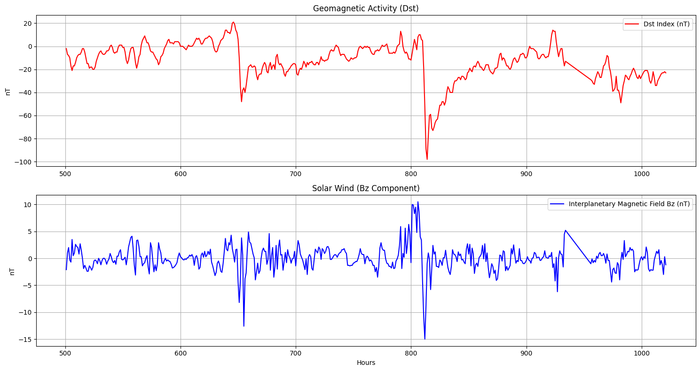
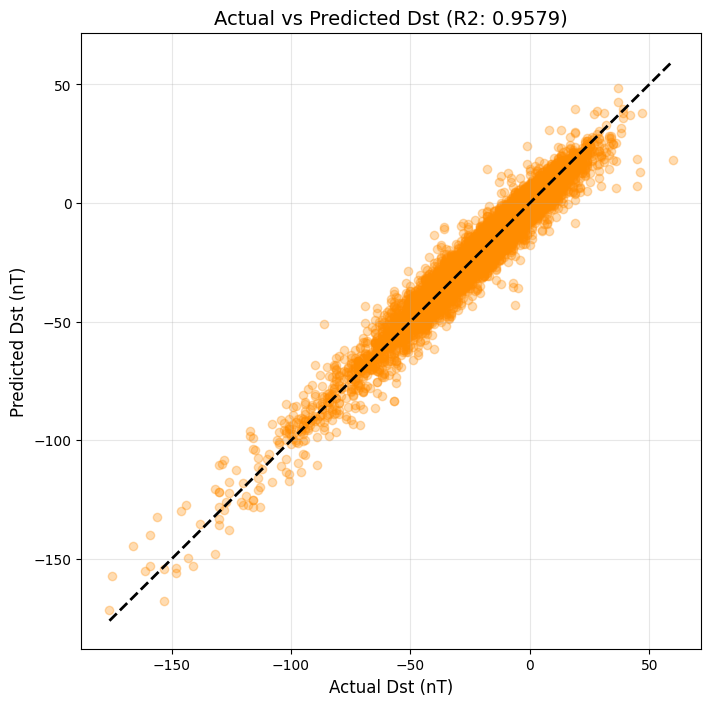
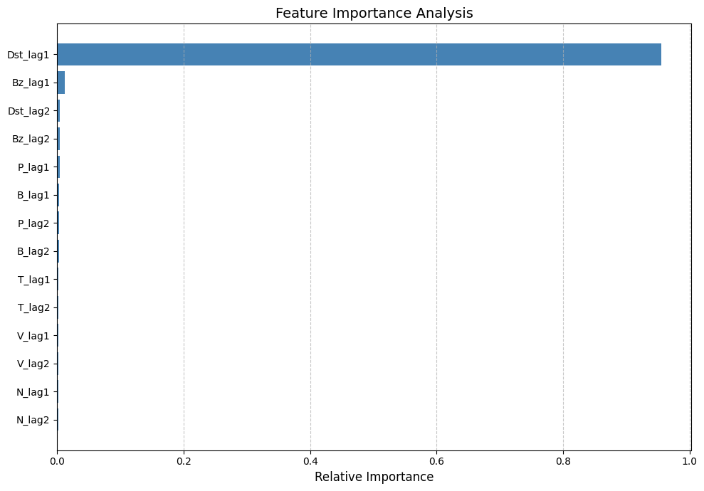
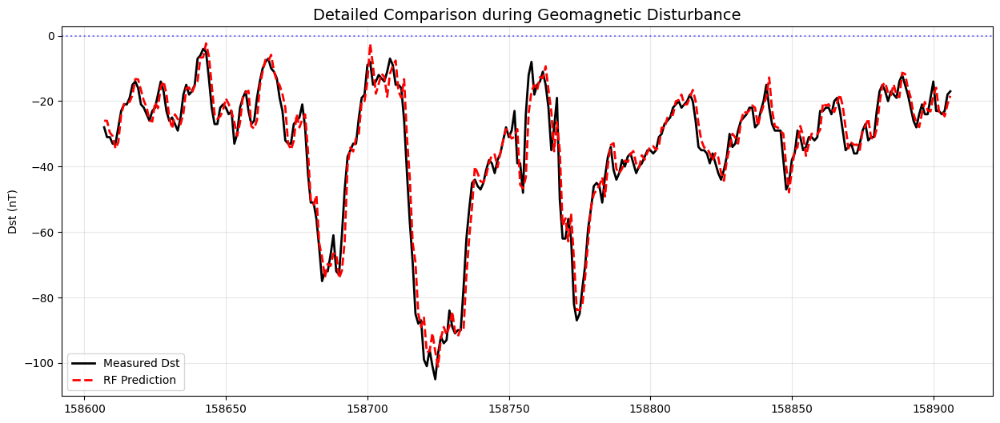

# Geomagnetic Storm Prediction using Random Forest 🛰️☀️

### 🔍 Forecasting the Dst Index based on 22 Years of NASA OMNIWeb Data

## 📌 Project Overview
This project was developed as part of my **Bachelor's Thesis at the Department of Physics, University of Patras**. The primary objective is to predict the **Dst (Disturbance Storm Time) index** using the **Random Forest** algorithm, leveraging solar wind parameters to forecast geomagnetic storm intensity.

## 🚀 Key Achievements
- **High Accuracy:** Achieved a Coefficient of Determination **$R^2 = 0.9579$** and **$RMSE = 3.22$ nT** on the test set.
- **Physics-Informed Feature Engineering:** Implemented a **Time-Lagging** strategy ($t-1, t-2$ offsets) to incorporate the magnetosphere's dynamic memory.
- **Big Data Analysis:** Processed and cleaned 22 years of high-resolution time-series data (1997-2019) from NASA's OMNIWeb database.

## 📊 Visual Analysis & Results

### 1. Solar Wind Bz vs Geomagnetic Activity

*Correlation between the Interplanetary Magnetic Field (IMF) $B_z$ component and the geomagnetic response.*

### 2. Actual vs Predicted Dst (Regression Analysis)

*Scatter plot showcasing the strong linear correlation ($R^2=0.96$) between measured and predicted values.*

### 3. Feature Importance (Random Forest)

*Analysis of variable contributions, highlighting the dominance of $B_z$ and the previous state ($Dst_{t-1}$).*

### 4. Time-Series Prediction Performance

*A side-by-side comparison of measured Dst values and model predictions over time.*

## 🛠️ Tech Stack
- **Language:** Python 3.x (Jupyter Notebook)
- **Libraries:** Scikit-learn, Pandas, NumPy, Matplotlib, Seaborn
- **Data Source:** [NASA OMNIWeb Service](https://omniweb.gsfc.nasa.gov/)

---
**Contact:** [giannisbetsanis@gmail.com] | [www.linkedin.com/in/giannis-betsanis-730018361]
